# RFIWIPER

Radio Frequency Interference software to clean up radio observations
of the SKAMPI telescope. Note that the software is a completly rewrote of the
RFIWIPER_2025 software package.


SKAMPI observation are stored in the HDF5 file file format with all
the availible meta data information availible by the special data
strutcture of the MPIfR.

In order to understand the working of the RFIWIPER we provide an example
observation. The test dataset is EDD_2023-05-19T05_42_23.848010UTC_yWRaJ.hdf5 and is availible via:

	ftp://ftp.mpifr-bonn.mpg.de/outgoing/hrk/EDD_2023-08-07T15_07_54.890197UTC_tnEks.hdf5


```
Usage: SKAMPI_RFI_WIPER.py [options]

Options:
  -h, --help            show this help message and exit
  --DATA_FILE=DATAFILE  DATA - HDF5 file of the Prototyp
  --USE_DATA=USEDATA    data to flag, default use all or select e.g.
                        "['P0','P1']" or "['S0']"
  --USE_NOISEDATA=USENOISEDATA
                        use data noise diode on and off "['ND0','ND1']",
                        default is "['ND0']"
  --USE_SCAN=USESCAN    select scan to flag, default are all scans, to choose
                        scan 000 and 001 use e.g. "['000','001']"
  --NOTUSE_CHANELRANGE=NOTUSECHANRANGE
                        exclude channel range from flagging procedure e.g.
                        '[0,2500]'
  --FG_BY_HAND=HAND_FG  Flag selection [[BLC [channel,time],TRC [channel,
                        time]], ...] in the waterfallplot e.g
                        [[[0,10],[5000,110]],[[10000,500],[15000,510]]]
  --FG_TIME_SIGMA=TIME_FG_SIGMA
                        determine bad time use threshold. default = 0 is off
                        use e.g. = 5
  --FG_SATURATION_SIGMA=SATURATION_FG_SIGMA
                        use the saturation information to flag. default = 0 is
                        off use e.g. = 3
  --FG_VELO_SIGMA=VELO_FG_SIGMA
                        determine flags based on the scanning velocity
                        outlieres on sky. [default = 0 is off use e.g. = 6]
  --FG_NOISE_SIGMA=NOISE_FG_SIGMA
                        determine flags based on the linear relation of noise
                        and power. [default = 0 is off use e.g. = 3]
  --FG_GROWTHRATE_SIGMA=GROWTHRATE_FG_SIGMA
                        determine flags based on the growthrate function
                        outliers. [default = 0 is off use e.g. = 6]
  --FG_SMOOTH_SIGMA=SMOOTH_FG_SIGMA
                        determine flags based on increase smooth kernel and
                        thresholding on difference org smooth spectra, use
                        also PROCESSING_TYPE see RFI_SETTINGS.json. [default =
                        0 is off use e.g. = 3]
  --PROCESSING_TYPE=FLAGPROCESSING
                        setting how accurate/much time the flagging proceed.
                        FAST (default), SLOW, INPUT uses the kernels of the
                        RFI_SETTINGS.json file.
  --FG_SMOOTH_THRESHOLDING_SIGMA=SMOOTH_THRESHOLDING_FG_SIGMA
                        determine flags based on smooth thresholding spectrum
                        (Tobi), see RFI_SETTINGS.json. [default = 0 is off use
                        e.g. = 10]
  --FG_BSLF_SIGMA=BSLF_FG_SIGMA
                        determine flags based on spectral baseline fit.
                        [default = 0 is off use e.g. = 10]
  --FG_WT_SMOOTHING_SIGMA=WTBYSMOOTHINGROW_FG_SIGMA
                        determine flags based on smoothing and thresholding
                        the waterfall spectrum in each time step, see
                        RFI_SETTINGS.json. very slow ! [default = 0 is off use
                        e.g. = 6]
  --FG_WT_FILTERING_SIGMA=WTBYFILTER_FG_SIGMA
                        determine flags based on filtering and thresholding
                        the entire waterfall spectrum, see RFI_SETTINGS.json.
                        very slow ! [default = 0 is off use e.g. = 3]
  --FG_CLEANUP_MASK     Clean up the processed mask, use specific pattern and
                        on the percentage in time and channel, see
                        RFI_SETTINGS.json. [default = False]
  --CHANGE_COORDS_TO_AZEL
                        Switch to Azimuth-Elevation scan type to be used for
                        velocity outlier flag and the plotting.
  --PLOT_SPEC           Plot the mean averaged in time spectrum.
  --FINAL_SPEC_YRANGE=FSPEC_YRANGE
                        [ymin,ymax]
  --PLOT_WATERFALL      Plot the waterfall spectrum
  --PLOT_OBS            Plot the observation DO_AZEL_SCAN to switch from RADEC
                        to AZEL
  --PLOT_WITH_INVERTED_MASK
                        Plot the final plots using an inverted mask
  --SAVE_PLOT           Save the plot as png files.
  --EDIT_MASK           Replace the original mask in the file with the new
                        mask.
  --RESET_MASK          Clear the original mask in the file.
  --SAVE_MASK=SAVEMASK  Save the mask into numpy npz file.
  --LOAD_MASK=LOADMASK  Load the mask from the numpy npz file.
  --SAVE_FINALSPECTRUM=SAVEFINALSPECTRUM
                        Safe the final 1d spectra as numpy npz file. [works
                        only with --DOPLOT_FINAL_SPEC]
  --SILENCE             Switch off all output
  --OBSINFO             Show observation info stored in the file
  --HELP                Show info on input
  
```


## Lets have a go on the file

- Get the **general information of the file/observation**

```
python SKAMPI_RFI_WIPER.py --DATA_FILE=EDD_2023-08-07T15_07_54.890197UTC_tnEks.hdf5 --OBSINFO
```

Here is an example of the information you might get (as an example we
show the info for scan 000 only):

	- General Information
		  FORMAT_VERSION 1
		  OBSERVATION_EPOCH 15
		  OBSID 31168
		  frequency_range [1.75e+09 3.50e+09]
		  receiver SBAND
		  receiver_id 3
		  sampling_rate 3500000000.0
		  starttime 2023-08-07T15:08:04.566
		  stoptime 2023-08-07T15:18:11.383
		  tags []
		  telescope SKA_MPG_PROTOTYPE_DISH
		  telescope_height 1086.0
		  telescope_latitude -30.71797756
		  telescope_longitude 21.41303794
		  SCAN ['000', '001', '002']
		  TYPE ['P0', 'P1']
		  NOISE ['ND0', 'ND1']
	  - Scan Info
		scan  000 type  P0_ND0
			 - time range:                  2023-08-07 15:08:04.566 2023-08-07 15:09:46.264
			 - total time:                  101.69868993759155  [s]
			 - percentage masked:           34.28597586096404 [%]
			 - gain un-masked:              0.7869813188782273 0.0014986986623538104 [mean, std]
			 - saturation un-masked:        14.525602409638553 4.191493960994627 [units]
			 - Azimuth [min, max, velo]:    148.4999709768404 151.8297019132748 0.033641740098453 0.000480926021060636 [deg, deg, deg/s, Delta deg/s]
			 - Elevation [min, max, velo]:  26.85145412732454 27.066377414916552 -3.210189161207029e-05 0.001205802671861964 [deg, deg, deg/s, Delta deg/s]
			 - RA [min, max, velo]:         293.4258129323272 295.9591201383342 0.022110027864230532 0.002786060194213124 [deg, deg, deg/s, Delta deg/s]
			 - DEC [min, max, velo]:        -65.13662681914403 -62.26515522554823 -0.02894284425705449 0.0006237228120458797 [deg, deg, deg/s, Delta deg/s]
			 - RA, DEC [min | max]:         19h33m42.19510376s -65d08m11.85654892s  |  19h43m50.1888332s -62d15m54.55881197s
			 - distance to  sun             129.3078693486661 , FoV  1.5966162332129297 [deg]
			 - distance to  moon            105.13112475664464 , FoV  1.5966162332129297 [deg]
			 - distance to  jupiter         110.14781690670279 , FoV  1.5966162332129297 [deg]

```
python SKAMPI_RFI_WIPER.py --DATA_FILE=EDD_2023-08-07T15_07_54.890197UTC_tnEks.hdf5 --PLOT_OBS --CHANGE_COORDS_TO_AZEL
```

The file contains 3 scans: 1 dip scan, and a cross-scan that is build up
from to two individual scans

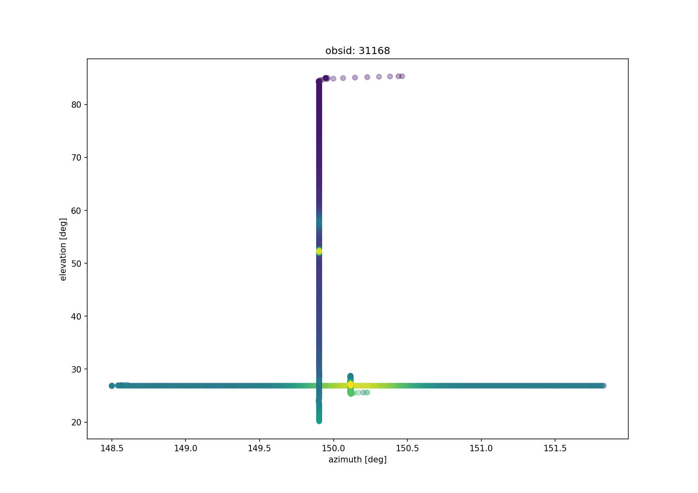

Plotting only the cross-scan you can use some selection function like:
```
python SKAMPI_RFI_WIPER.py --DATA_FILE=EDD_2023-08-07T15_07_54.890197UTC_tnEks.hdf5 --PLOTOBS --USE_SCAN="['000','001']"
```
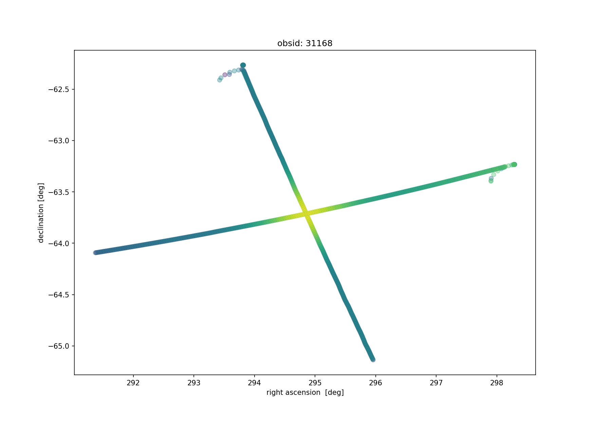

Plotting the waterfall spectrum of the cross-scan for one
polarisation (P0) and noise diode off (ND0):

```
python SKAMPI_RFI_WIPER.py --DATA_FILE=EDD_2023-08-07T15_07_54.890197UTC_tnEks.hdf5 --USE_SCAN="['000','001']" --PLOT_WATERFALL --USE_DATA="['P0']"
```


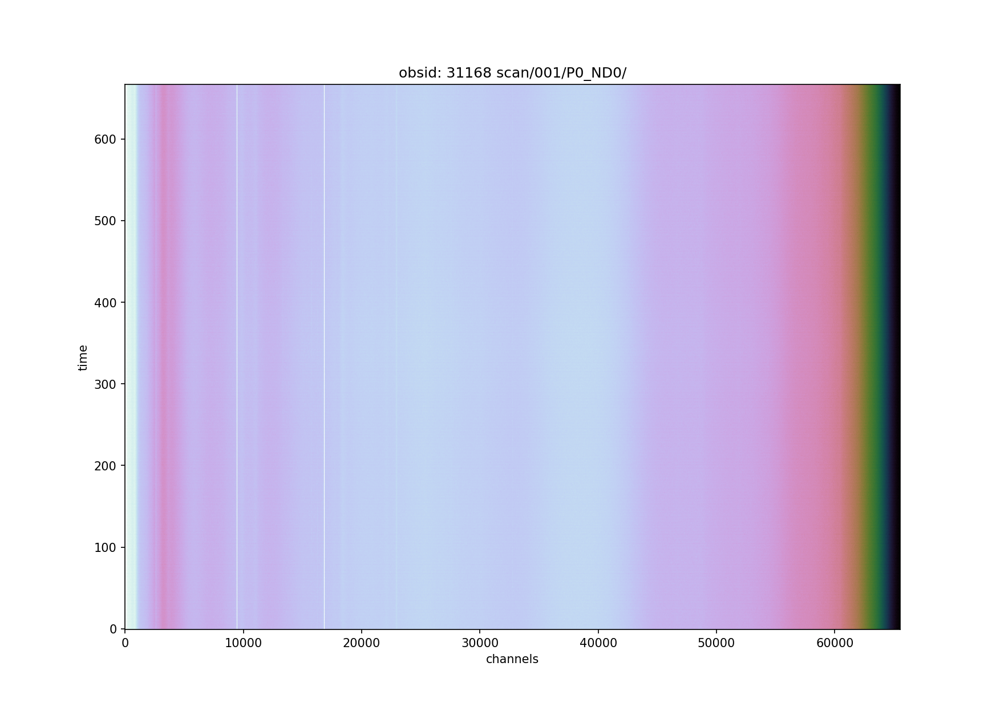

Plotting the time averaged spectrum (and errors in red) of the cross-scan for one
polarisation (P0) and noise diode off (ND0):

```
python SKAMPI_RFI_WIPER.py --DATA_FILE=EDD_2023-08-07T15_07_54.890197UTC_tnEks.hdf5 --USE_SCAN="['000','001']" --PLOT_SPEC --USE_DATA="['P0']"
```

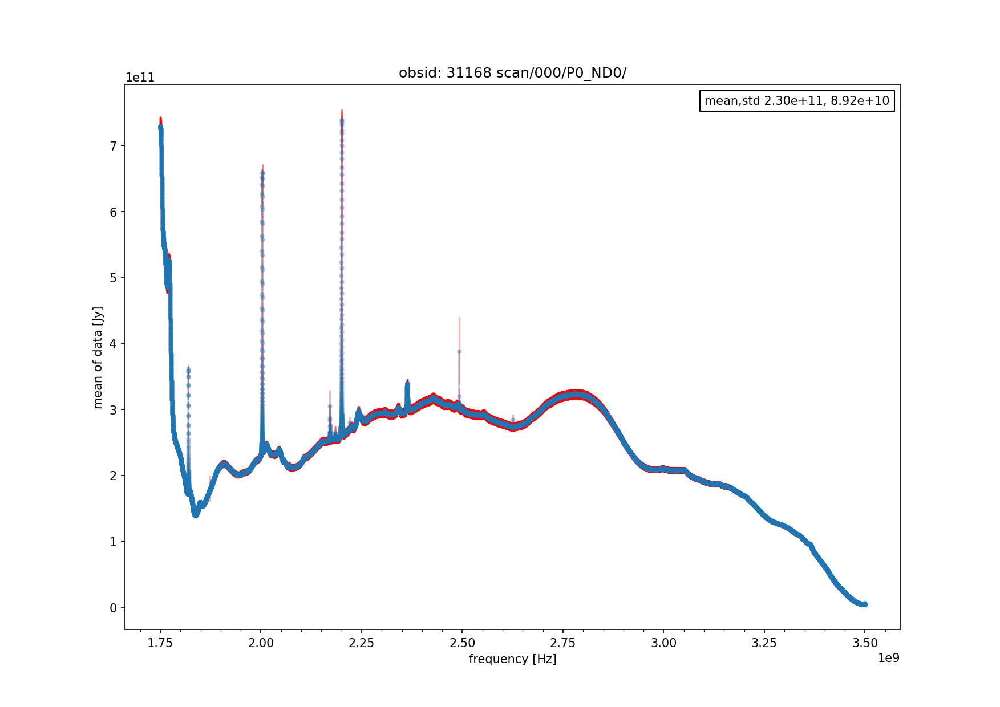


## Lets do some flagging 

**Flagging by hand (--FG_BY_HAND=)**

```
python SKAMPI_RFI_WIPER.py --DATA_FILE=EDD_2023-08-07T15_07_54.890197UTC_tnEks.hdf5 --USE_SCAN="['000']" --PLOT_WATERFALL --USE_DATA="['P0']" --FG_BY_HAND=[[[0,10],[5000,110]],[[10000,500],[15000,510]]]
```

	- Hand FG in time
		 idx:  [[0, 10], [5000, 110]]
			 timerange:  ['2023-08-07T15:08:06.100'] ['2023-08-07T15:08:21.439']
			 azimut range:  148.50001436504743 148.97679653725933
			 elevation range:  26.85311611971108 26.869723815485138
		 idx:  [[10000, 500], [15000, 510]]
			 timerange:  ['2023-08-07T15:09:21.261'] ['2023-08-07T15:09:22.795']
			 azimut range:  150.98867579905863 151.04054081652134
			 elevation range:  26.868203721362452 26.870231521950398

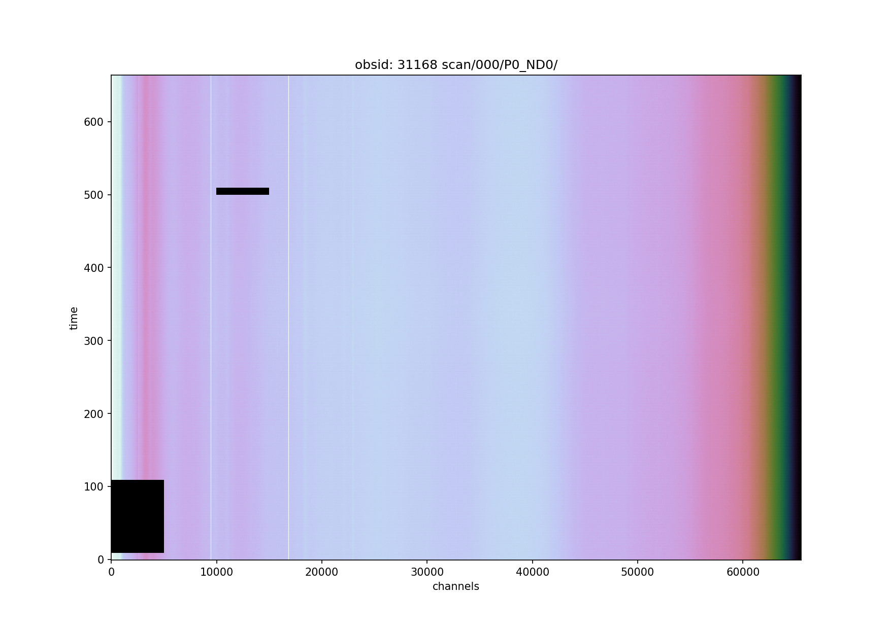


**Flagging in time by outlieres in amplitude (--FG_TIME_SIGMA=)**

Averaging over the entire spectrum and determine outliers in time.  In case you have strong
astronomical sources in the scan (e.g. survey scan) this time range
could be masked out.

```
python SKAMPI_RFI_WIPER.py --DATA_FILE=EDD_2023-08-07T15_07_54.890197UTC_tnEks.hdf5 --USE_SCAN="['002']" --PLOT_WATERFALL --USE_DATA="['P0']" --FG_TIME_SIGMA=2
```

We used a small sigma to show the effect. The source and the lower
azimuth range has been flagged in the dip scan.

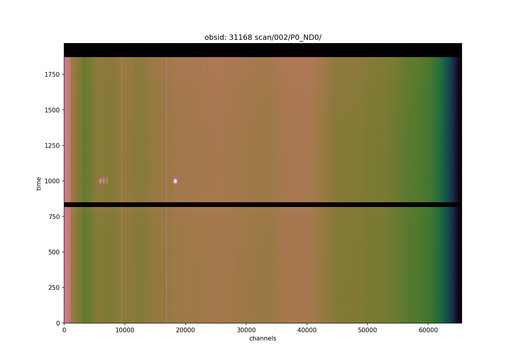


**Flagging in time by outlieres of the saturation information (--FG_SATURATION_SIGMA=)**

Based on the saturation information the SKAMPI data, outlieres will be
determine and times will be flagged. In case you have strong
astronomical sources in the scan (e.g. survey scan) this time range
could be masked out.

```
python SKAMPI_RFI_WIPER.py --DATA_FILE=EDD_2023-08-07T15_07_54.890197UTC_tnEks.hdf5 --USE_SCAN="['002']" --PLOT_WATERFALL --USE_DATA="['P0']" --FG_SATURATION_SIGMA=6
```

Note that the weaker source has not been flagged out, however if you scan over
Taurus  A it will be flagged, be cautious!

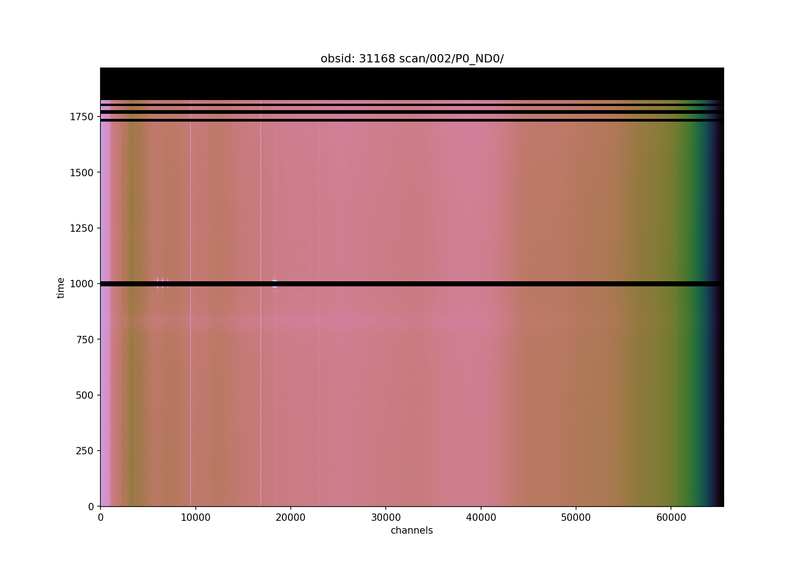


**Flagging in time by outliers in scanning velocity (--FG_VELO_SIGMA=)**
Based on the scanning velocity of the telescope times will be flagged
by outliers. Note you need to know which coordinates you need to
use. The default is right acension and declination to switch to
azimuth and elevation (e.g. survey scans, dip scans ) use --CHANGE_COORDS_TO_AZEL

```
python SKAMPI_RFI_WIPER.py --DATA_FILE=EDD_2023-08-07T15_07_54.890197UTC_tnEks.hdf5 --USE_SCAN="['000','001']" --USE_DATA="['P0']" --FG_VELO_SIGMA=5 --PLOT_OBS
```

Here we are flagging the cross-scan 

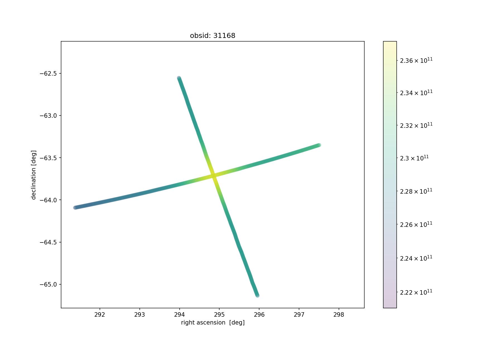


**Flagging in frequency by outliers in the linear relation between
noise and power (--FG_NOISE_SIGMA=)**
This works on the time averaged spectrum. Assume that the system noise depends on the receiving power (single
dish data). Perform a linear fit and check for outliers in the
linearity.

```
python SKAMPI_RFI_WIPER.py --DATA_FILE=EDD_2023-08-07T15_07_54.890197UTC_tnEks.hdf5 --USE_SCAN="['000']" --USE_DATA="['P0']" --FG_NOISE_SIGMA=3 --PLOT_SPEC
```

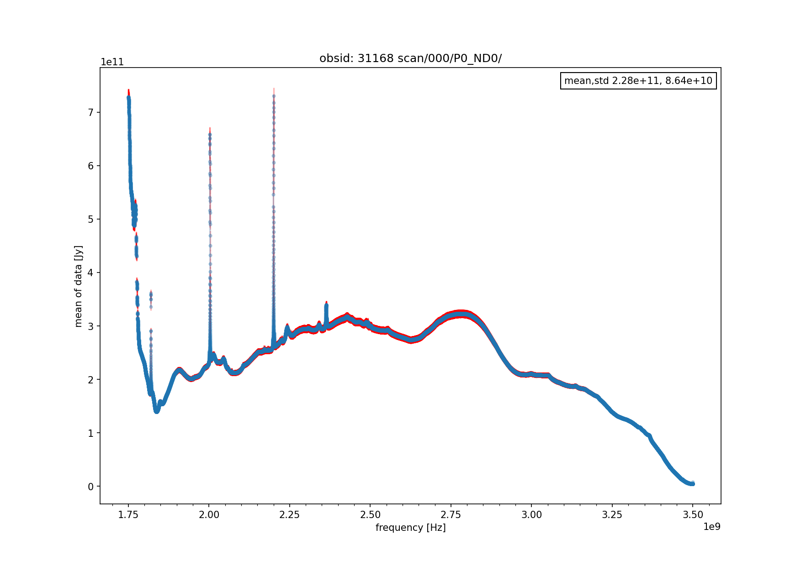


**Flagging in frequency by outliers in the growthrate function of the
spectrum  (--FG_GROWTHRATE_SIGMA)**
This works on the time averaged growth rate spectrum and exclude
outliers. 

```
python SKAMPI_RFI_WIPER.py --DATA_FILE=EDD_2023-08-07T15_07_54.890197UTC_tnEks.hdf5 --USE_SCAN="['000']" --USE_DATA="['P0']" --FG_GROWTHRATE_SIGMA=3 --PLOT_SPEC
```

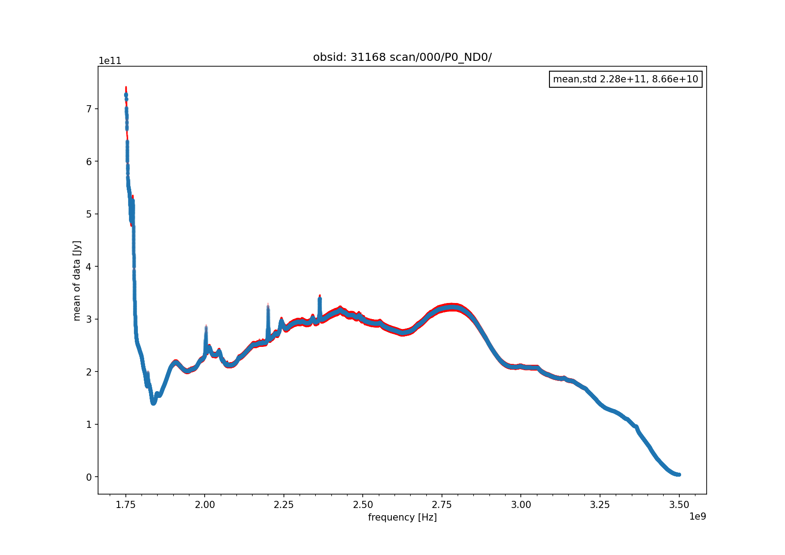


**Flagging in frequency by outliers in the difference between the
original and smoothed spectrum  (--FG_SMOOTH_SIGMA=)**
This works on the time averaged spectrum and decreasing number of
kernel sizes. The input to that function can be adapted in the
RFI_SETTINGS.json file. Smoothing type is by default mean, but can be
changed to (hamming, gaussian, median, wiener, minimum) and with --PROCESSING_TYPE= setting one can
define either with =INPUT to use the predefined kernels in
("wt_kernels_size_INPUT") or define a short or long sequenz of
increasing kernel sizes the limit can be defined by
wt_kernel_size_limit_SEQUENCE.

```
python SKAMPI_RFI_WIPER.py --DATA_FILE=EDD_2023-08-07T15_07_54.890197UTC_tnEks.hdf5 --USE_SCAN="['000']" --USE_DATA="['P0']" --FG_SMOOTH_SIGMA=6 --PLOT_SPEC
```

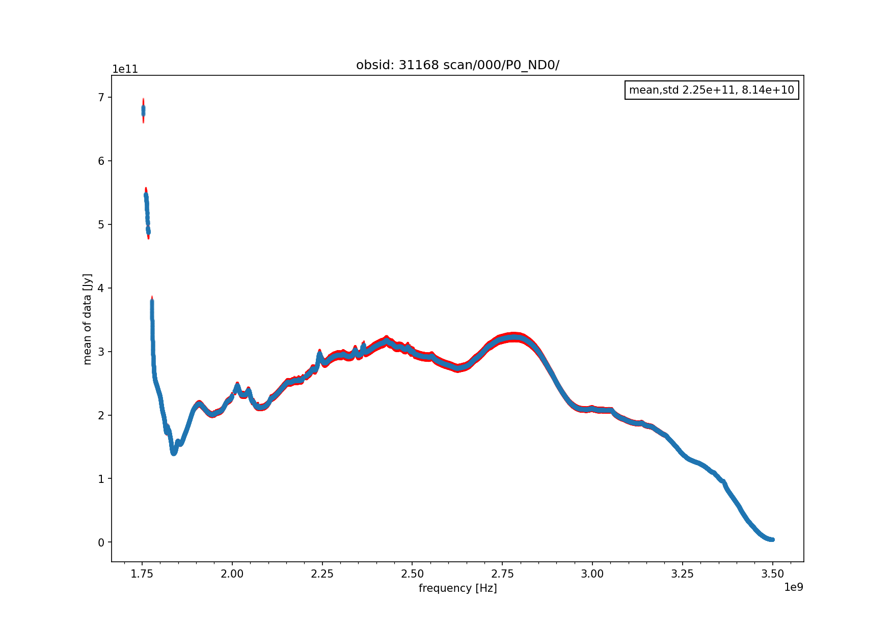


**Flagging in frequency by outliers in the difference between the
original and smoothed spectrum  (--FG_SMOOTH_THRESHOLDING_SIGMA=)**
This works on the time averaged spectrum and decreasing number of
kernel sizes. Similar the do_smooth_sigma, but the interpolation of
the masked array an the kernels are fixed.

```
python SKAMPI_RFI_WIPER.py --DATA_FILE=EDD_2023-08-07T15_07_54.890197UTC_tnEks.hdf5 --USE_SCAN="['000']" --USE_DATA="['P0']" --FG_SMOOTH_THRESHOLDING_SIGMA=10 --PLOT_SPEC
```

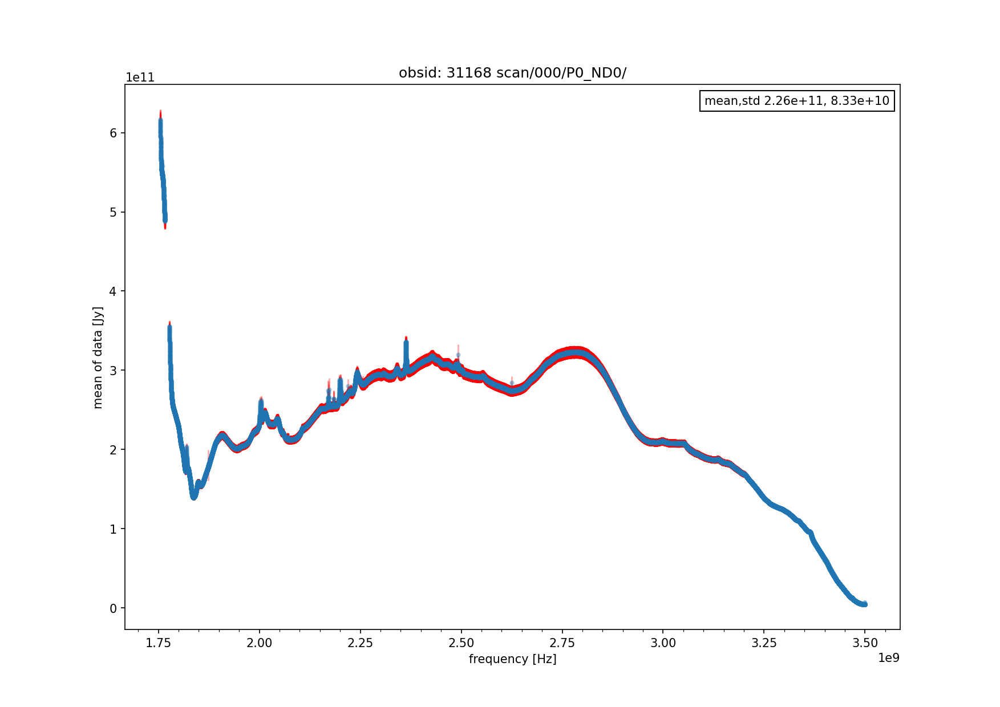


**Flagging in frequency by outliers applying a spectral baseline fit (--FG_BSLF_SIGMA=)**
Using various baseline fits by the [pybaselines package](
https://pybaselines.readthedocs.io/en/latest/) and determine
the minimum derivation to select the best fit and use the difference
to determine outliers.

The following baseline fit functions are used from pybaselines:
                              whittaker.airpls, whittaker.arpls,
                              whittaker.aspls, whittaker.derpsalsa ,
                              whittaker.drpls, whittaker.iarpls,
                              whittaker.iasls, whittaker.psalsa

```
python SKAMPI_RFI_WIPER.py --DATA_FILE=EDD_2023-08-07T15_07_54.890197UTC_tnEks.hdf5 --USE_SCAN="['000']" --USE_DATA="['P0']" --FG_BSLF_SIGMA=6 --PLOT_SPEC
```

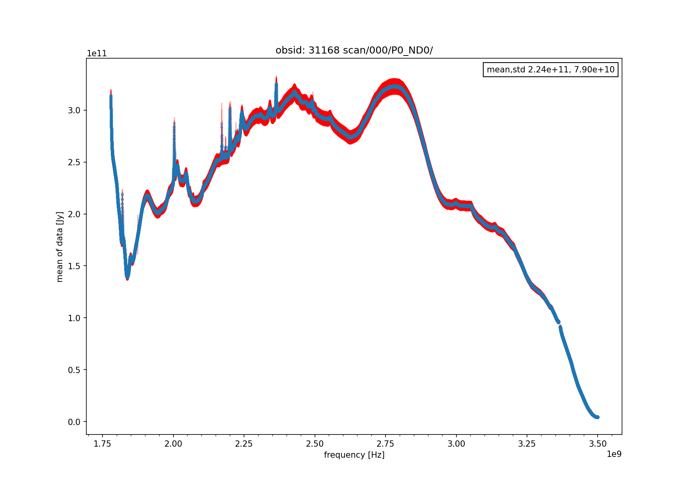


**Flagging in frequency by outliers applying a spectral baseline fit (--FG_WT_SMOOTHING_SIGMA=)**
Work on the waterfall spectrum and determine flags based on smoothing and thresholding
the waterfall spectrum in each time step, with increasing kernel
sizes. See abow. The input to that function can be adapted in the
RFI_SETTINGS.json file. See the smoothing wt settings. Caution this
may take a long time.


```
python SKAMPI_RFI_WIPER.py --DATA_FILE=EDD_2023-08-07T15_07_54.890197UTC_tnEks.hdf5 --USE_SCAN="['000']" --USE_DATA="['P0']" --FG_WT_SMOOTHING_SIGMA=6 --PROCESSING_TYPE=FAST --PLOT_WATERFALL
```

Note this process took 158 seconds to complete the masking for the FAST processing
type. In case you are using survey scans and the individual times differ quite a lot,
you may want to invest the time.


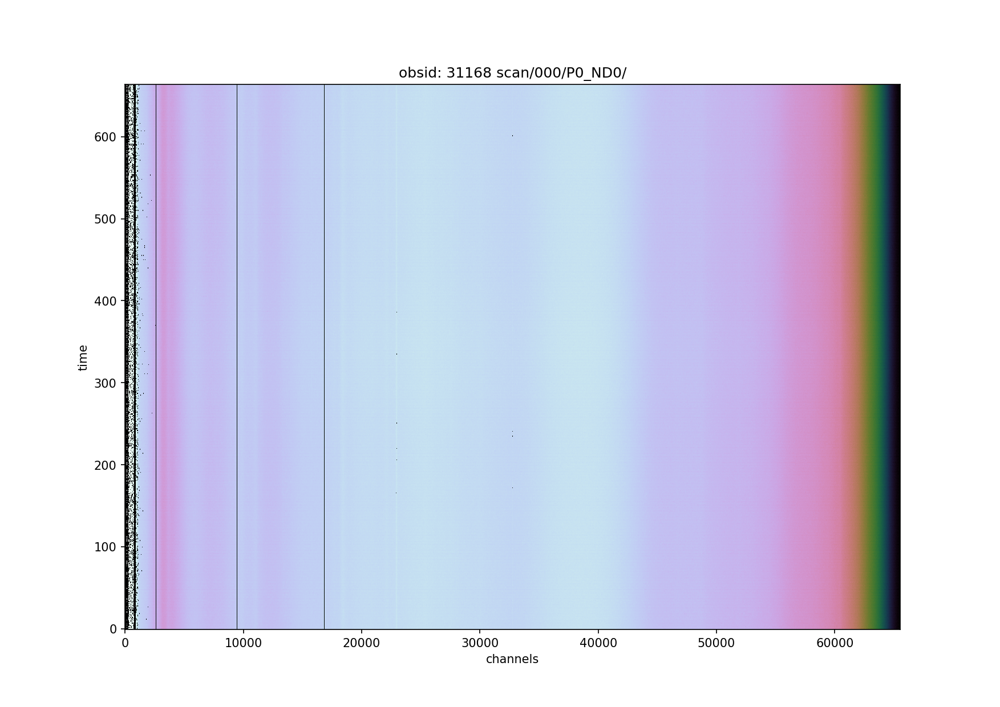


**Flagging in frequency by outliers applying a spectral baseline fit (--FG_WT_FILTERING_SIGMA=)**
Work on the waterfall spectrum and determine flags based on smoothing
and thresholding the difference waterfall spectrum . The input to that function can be adapted in the
RFI_SETTINGS.json file. See the smoothing filter wt settings.

```
python SKAMPI_RFI_WIPER.py --DATA_FILE=EDD_2023-08-07T15_07_54.890197UTC_tnEks.hdf5 --USE_SCAN="['000']" --USE_DATA="['P0']" --FG_WT_FILTERING_SIGMA=6 --PROCESSING_TYPE=FAST --PLOT_WATERFALL
```

Note this process took 45 seconds to complete the masking.

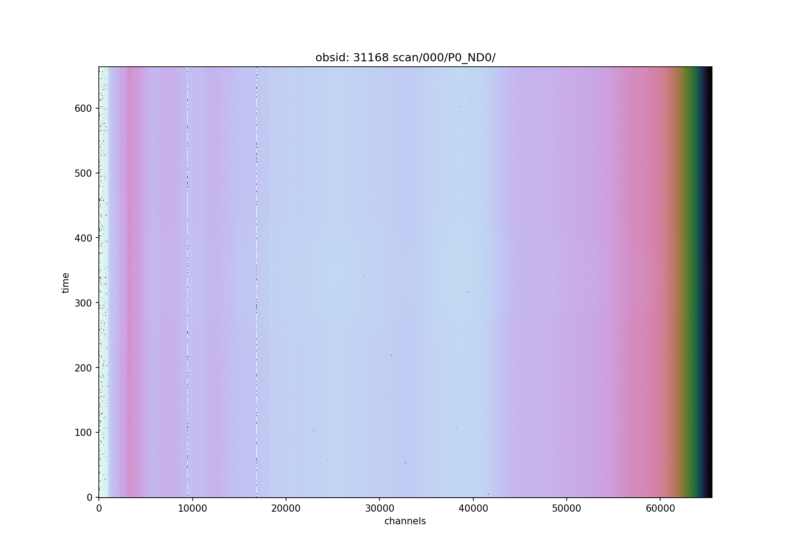


**Flagging on pattern in the mask (--FG_CLEANUP_MASK)**
Work on the mask an check for single isolated channels, etc. The
pattern are defined in the RFI_SETTINGS.json file.


**Note that you can do the flagging in steps (--NOTUSE_CHANELRANGE=)**
With this setting you can actually run the flagging on a sub-channel
range and store the new mask in the data and repeat this process with
definieng a different channel range.


## Full flagging process on the dataset 

As an example we applied some of the flagging processes. The software
can not sequence the individual processes, instead it first process the
flagging on the meta data (amp, scan velocity, saturation, noise, growthrate),
process the smoothing/filtering on the waterfall spectrum, and finally
works on the time averaged spectrum. The flagging builds on top of
each other, as such that the flagging process will update the mask,
that will be used in the nest step. 


```
python SKAMPI_RFI_WIPER.py
--DATA_FILE=../../../OBSERVATION_EXAMPLES/EDD_2023-08-07T15_07_54.890197UTC_tnEks.hdf5
--USE_SCAN="['000','001']" --USE_DATA="['P0']" --FG_GROWTHRATE_SIGMA=3
--FG_SMOOTH_SIGMA=3 --PROCESSING_TYPE=INPUT --PLOT_SPEC --PLOT_WATERFALL
```

look at the output 

	generate mask for :  scan/000/P0_ND0/

	- FG channels on growth rate spectrum
		 flagged:  595 channels
	- FG channels on smooth spectrum
		 kernel:  mean , size  [83, 43, 11, 7, 5, 3]  Type  INPUT
			 SWPD  :  1024
			 boundary smoothing kernel:  hamming , size  31
		 flagged:  2591 channels

	Full masking needed  0.3544179999999999  [s]

   === Generate 1d Spectrum plot ===

	mask:                scan/000/P0_ND0/   3  %
	generate plot for :  scan/000/P0_ND0/

   === Generate waterfall plot ===

	mask:                scan/000/P0_ND0/   3  %
	generate plot for :  scan/000/P0_ND0/
	
Note to make the flagging applied to the dataset you need to set --EDIT_MASK

This seems to generate a reasonable clean spectrum.


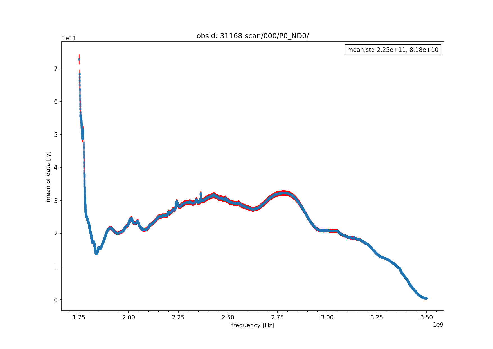
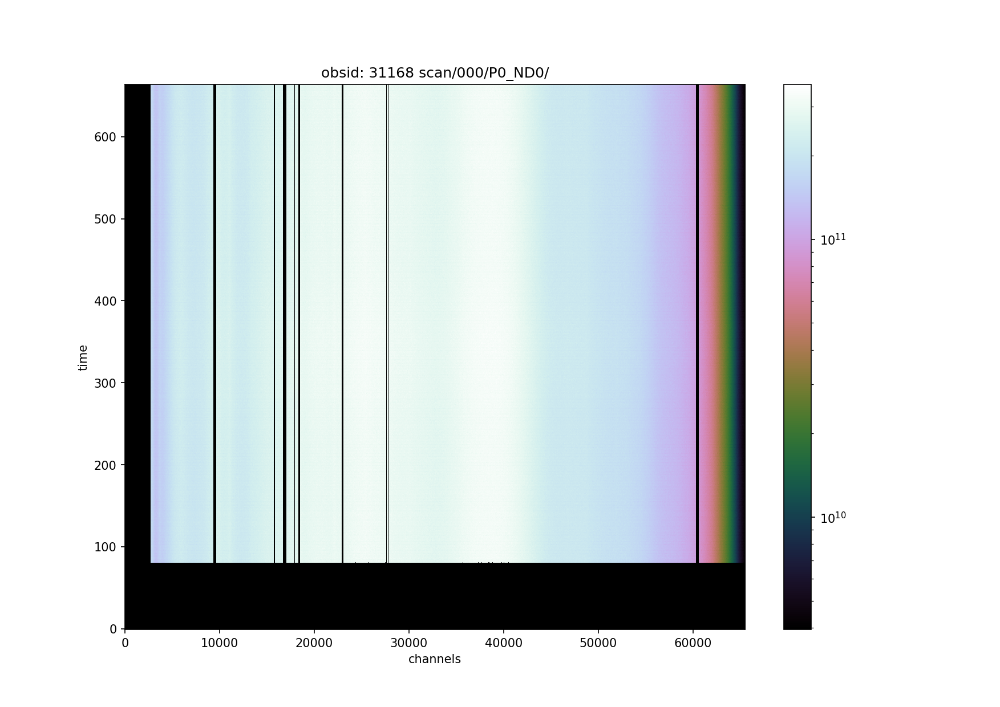


## Additional information

1. Some explanation to the settings file RFI_WIPER_SETTINGS.json


This still needs to come in 2026!

wt_kernels_size_INPUT

Smoothing type is by default mean, but can be
changed to (hamming, gaussian, median, wiener, minimum) and with
("wt_kernels_size_INPUT") or def

wt_kernels_size_limit 

this is a powerfull tool setting.

"envelop_xy_bins":1024 split the spectrum into 1024 SPWD 


2. [Information on SKAMPI data](https://github.com/hrkloeck/SKAMPI_DATA/tree/main)

3. [Setup your working environment](https://github.com/hrkloeck/SKAMPI_DATA/tree/main/setup_environment)


## Contributing people

	- Claudia Comito
    - Tobias Winchen 

