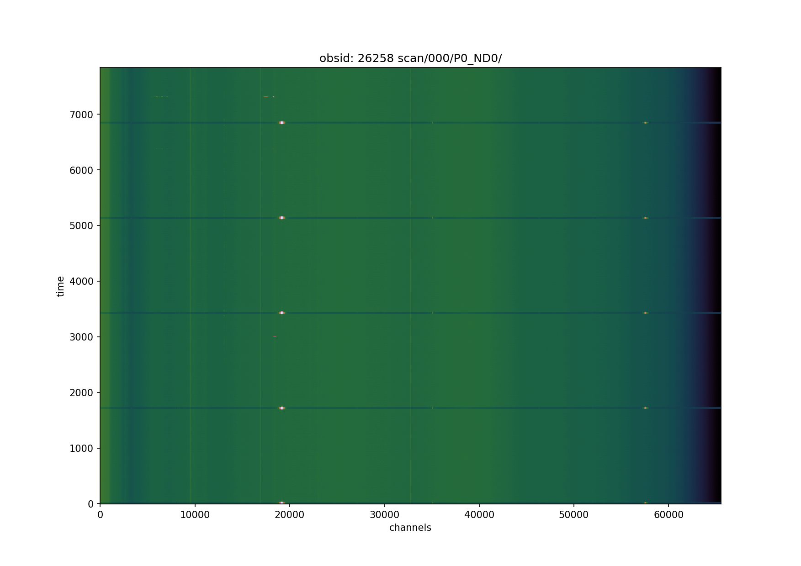
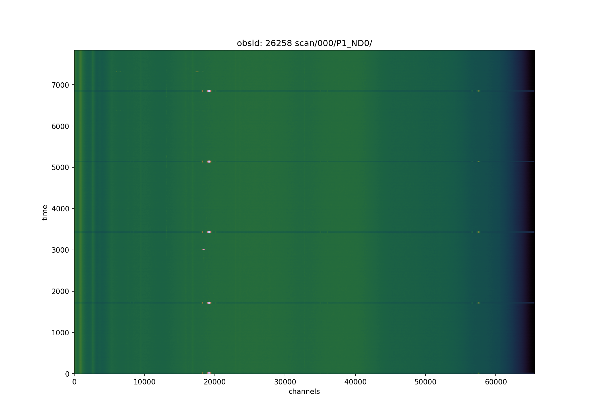

# RFIWIPER
Radio frequency interference software

Base is first a HDF5 file from SKAMPI to understand some of the issues we encountered for uncalibrated datasets
The first test dataset is EDD_2023-05-19T05_42_23.848010UTC_yWRaJ.hdf5 and is availible via:

	ftp://ftp.mpifr-bonn.mpg.de/outgoing/hrk/EDD_2023-05-19T05_42_23.848010UTC_yWRaJ.hdf5

 more to come in the future.


```
python CHECK_SURVEY_SCANS.py
Usage: CHECK_SURVEY_SCANS.py [options]

Options:
  -h, --help            show this help message and exit
  --DATA_FILE=DATAFILE  DATA - HDF5 file of the Prototyp
  --USEDATA=USEDATA     use data noise diode off and on "['ND0','ND1']",
                        default is ['ND0']
  --DONOTFLAG           Do not flag the data.
  --DO_FG_TIME_BY_HAND_=HAND_TIME_FG
                        use the time index of the waterfall plot e.g.
                        [[0,10],[100,110]]
  --DOPLOT_FINAL_SPEC   Plot the final spectrum after Flagging
  --FINAL_SPEC_YRANGE=FSPEC_YRANGE
                        [ymin,ymax]
  --DOPLOT_FINAL_WATERFALL
                        Plot the final waterfall after Flagging
  --DOSAVEPLOT          Save the plots as figures
  --EDIT_FLAG           Switch to replace the old with the new mask
  --RESET_FLAG          Switch to clear all mask
  --DOSAVEMASK=SAVEMASK
                        Save the mask into numpy npz file.
  --DOLOADMASK=LOADMASK
                        Upload the mask.
  --DONOTCPUS           Switch off using multiple CPUs on the maschine
  --USENCPUS=USENCPUS   Define the number of CPUs to use
  --SILENCE             Switch off all output
  --HELP                Show info on input


```


## Lets have a go on the file

```
python CHECK_SURVEY_SCANS.py --DATA_FILE=EDD_2023-05-19T05_42_23.848010UTC_yWRaJ.hdf5 --DONOTFLAG --DOPLOT_FINAL_WATERFALL --DOPLOT_FINAL_SPEC --FINAL_SPEC_YRANGE='[-2E12,2E12]' --DOSAVEPLOT
```

Waterfall Spectrum per polarisation (P0/P1)



{width=25%}
{width=25%}

Spectrum per polarisation (P0/P1)

{width=25%}
{width=25%}


```
python CHECK_SURVEY_SCANS.py --DATA_FILE=EDD_2023-05-19T05_42_23.848010UTC_yWRaJ.hdf5 --DONOTFLAG --DOPLOT_FINAL_SPEC --FINAL_SPEC_YRANGE='[-2E12,2E12]' --DOPLOT_FINAL_WATERFALL --DO_FG_TIME_BY_HAND='[[0,40],[1695,1750],[3405,3455],[5114,5162],[6820,6875]]'
```
