# RFIWIPER
Radio frequency interference software

Base is first a HDF5 file from SKAMPI to understand some of the issues we encountered for uncalibrated datasets
The first test dataset is EDD_2023-05-19T05_42_23.848010UTC_yWRaJ.hdf5 and is availible via:

	ftp://ftp.mpifr-bonn.mpg.de/outgoing/hrk/EDD_2023-05-19T05_42_23.848010UTC_yWRaJ.hdf5

 more to come in the future.


```
python SKAMPI_RFI_TOOL.py -h

Usage: SKAMPI_RFI_TOOL.py [options]

Options:

-h, --help            show this help message and exit
  --DATA_FILE=DATAFILE  DATA - HDF5 file of the Prototyp
  --USEDATA=USEDATA     use data to flag default is "['P0','P1']", for Stokes
                        use e.g. "['S0']"
  --USENOISEDATA=USENOISEDATA
                        use data noise diode on and off "['ND0','ND1']",
                        default is "['ND0']"
  --USESCAN=USESCAN     select scan to flag, default are all scans, to choose
                        scan 000 and 001 use e.g. "['000','001']"
  --DONOTHEAVYFLAG      Do not use the time heavy flag procedure.
  --PROCESSING_TYPE=FLAGPROCESSING
                        setting how accurate/much time the flagging proceed.
                        FAST, SEMIFAST, SLOW, default is SEMIFAST
  --DO_FG_TIME_BY_HAND=HAND_TIME_FG
                        use the time index of the waterfall plot e.g.
                        [[0,10],[100,110]]
  --DO_FG_TIME_AUTO_SIGMA=AUTO_TIME_FG_SIGMA
                        automatically determine bad time use threshold.
                        default = 0 is off use e.g. = 5
  --DO_FG_SATURATION_SIGMA=SATURATION_FG_SIGMA
                        use the saturation information to flag. default = 0 is
                        off use e.g. = 3
  --DO_FG_BOUNDARY_SIGMA=BOUND_SIGMA_INPUT
                        if the spectrum is mask to much at the edges increase.
                        [default = 3 sigma]
  --DO_FG_VELO_SCAN_SIGMA=SCAN_VELO_FG_SIGMA
                        determine flags based on the scan velocity outliere on
                        sky. [default = 0 is off use e.g. = 6]
  --DO_RFI_STD_MEAN_SIGMA=FLAG_RFI_STD_MEAN_SIGMA
                        determine flags based on the linear relation of noise
                        and power. [default = 0 is off use e.g. = 3]
  --DO_SMOOTH_SIGMA=FLAG_SMOOTH_SIGMA
                        determine flags based on smooth spectrum, see
                        RFI_SETTINGS.json. [default = 0 is off use e.g. = 3]
  --DO_BSLF_SIGMA=FLAG_BSLF_SIGMA
                        determine flags based on spectral baseline fit.
                        [default = 0 is off use e.g. = 10]
  --DO_AZEL_SCAN        Switch to Azimuth-Elevation scan type to be used for
                        velocity outliere flag.
  --DOPLOT_FINAL_SPEC   Plot the final spectrum after Flagging
  --FINAL_SPEC_YRANGE=FSPEC_YRANGE
                        [ymin,ymax]
  --DOPLOT_FINAL_WATERFALL
                        Plot the final waterfall after Flagging
  --DOPLOT_WITH_INVERTED_MASK
                        Plot the final plots using an inverted mask
  --DOSAVEPLOT          Save the plots as figures
  --EDIT_FLAG           Switch to replace the old with the new mask
  --RESET_FLAG          Switch to clear all mask
  --DOSAVEMASK=SAVEMASK
                        Save the mask into numpy npz file.
  --DOSAVEFINALSPECTRUM=SAVEFINALSPECTRUM
                        Safe the final 1d spectra as numpy npz file. [works
                        only with --DOPLOT_FINAL_SPEC]
  --DOLOADMASK=LOADMASK
                        Upload the mask.
  --DONOTCPUS           Switch off using multiple CPUs on the maschine
  --USENCPUS=USENCPUS   Define the number of CPUs to use
  --SILENCE             Switch off all output
  --DO_RFI_REPORT=DO_RFI_REPORT
                        provides info and SPWD plots. Input is number of SPWD
                        [default = -1, use e.g. 8]
  --DO_RFI_REPORT_SIGMA=DO_RFI_REPORT_SIGMA
                        set the y-range of the SPWDs plots of the RFI report
                        [default = 5]
  --OBSINFO             Show observation info stored in the file
  --HELP                Show info on input
  
```


## Lets have a go on the file

- Just look at the **original dataset without flagging**

```
python SKAMPI_RFI_TOOL.py --DATA_FILE=EDD_2023-05-19T05_42_23.848010UTC_yWRaJ.hdf5 --DONOTHEAVYFLAG --DOPLOT_FINAL_WATERFALL --DOPLOT_FINAL_SPEC --FINAL_SPEC_YRANGE='[-2E12,2E12]' --DOSAVEPLOT
```

Waterfall Spectrum per polarisation (P0/P1)


Averaged Spectrum (mean) and the standart derivation as error's in red per polarisation (P0/P1)

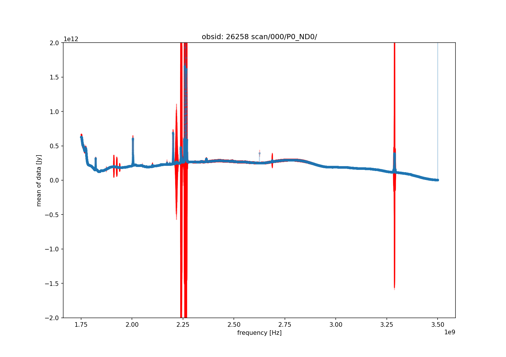
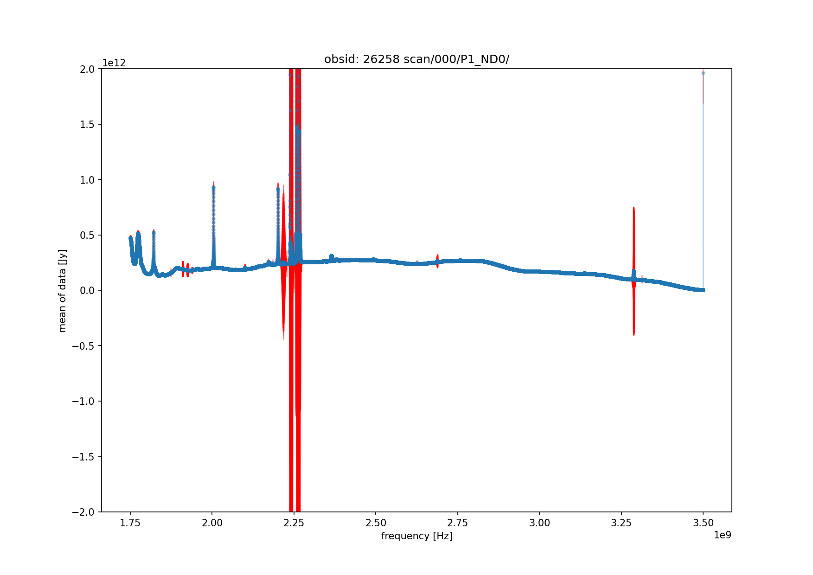


- Just **flag by hand** some times

```
python SKAMPI_RFI_TOOL.py --DATA_FILE=EDD_2023-05-19T05_42_23.848010UTC_yWRaJ.hdf5 --DONOTHEAVYFLAG --DOPLOT_FINAL_SPEC --FINAL_SPEC_YRANGE='[-2E12,2E12]' --DOPLOT_FINAL_WATERFALL --DO_FG_TIME_BY_HAND='[[0,40],[1695,1750],[3405,3455],[5114,5162],[6820,6875]]' --DOSAVEPLOT
```

This also provides some output e.g. for the first entry of the --DO_FG_TIME_BY_HAND settings

	- Hand FG in time
                 idx:  [0, 40]
                 timerange:  [['2023-05-19T05:42:44.695'] ['2023-05-19T05:42:50.831']]
                 azimut range:  62.49950015950033 63.723815246821935
                 elevation range:  30.716222703473235 30.716722503502545


Waterfall Spectrum per polarisation (P0/P1)

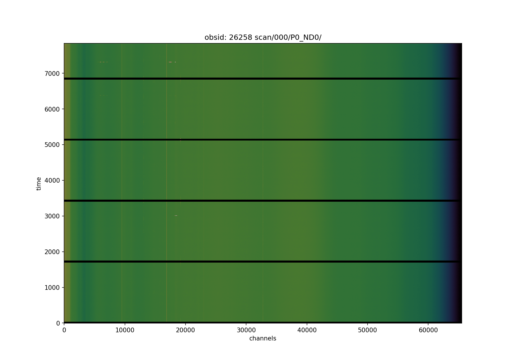
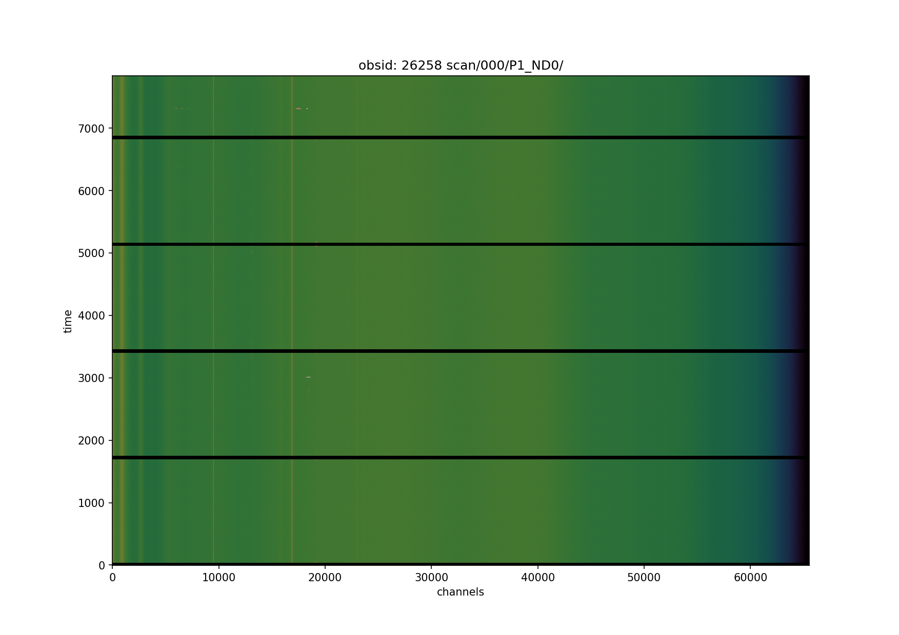

Averaged Spectrum (mean) and the standart derivation as error's in red per polarisation (P0/P1)

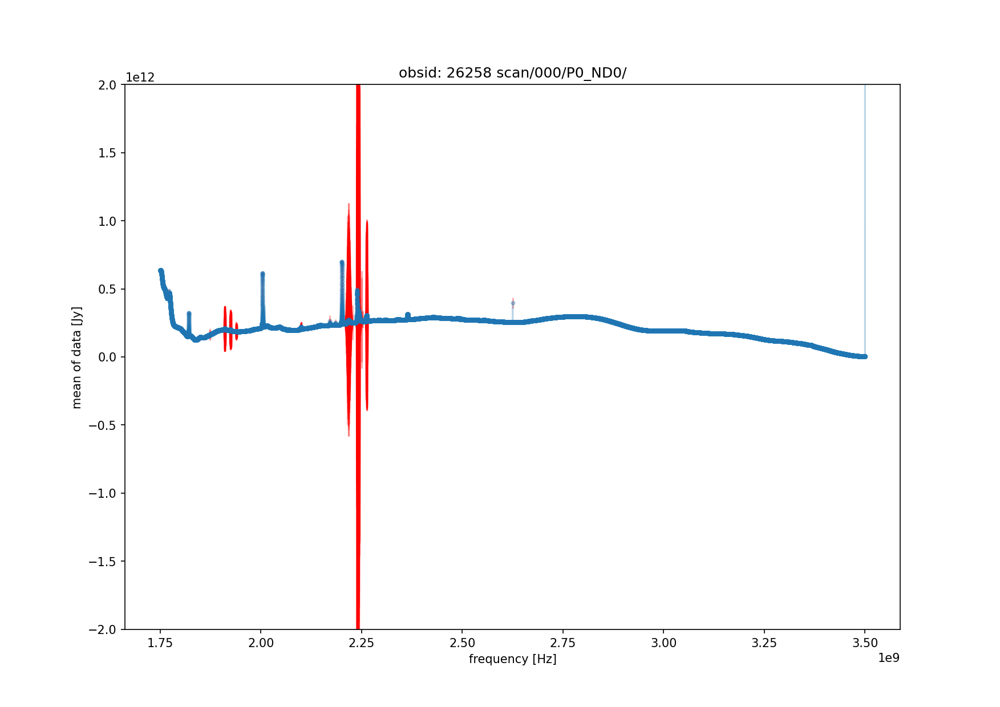
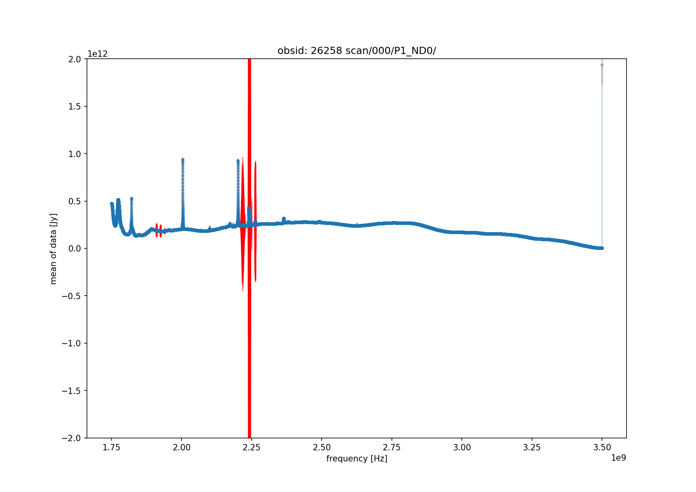


- Now lets do eveything **except** the heavy flagging 

```
python -W ignore SKAMPI_RFI_TOOL.py --DATA_FILE=EDD_2023-05-19T05_42_23.848010UTC_yWRaJ.hdf5 --DONOTHEAVYFLAG --DO_FG_TIME_AUTO_SIGMA=5 --DO_FG_VELO_SCAN_SIGMA=6 --DO_RFI_STD_MEAN_SIGMA=3 --DO_BSLF_SIGMA=10 --DOPLOT_FINAL_WATERFALL --DOPLOT_FINAL_SPEC --DOSAVEPLOT --DOSAVEMASK=FULL_FLAG_MASK 
```
Waterfall Spectrum per polarisation (P0/P1)

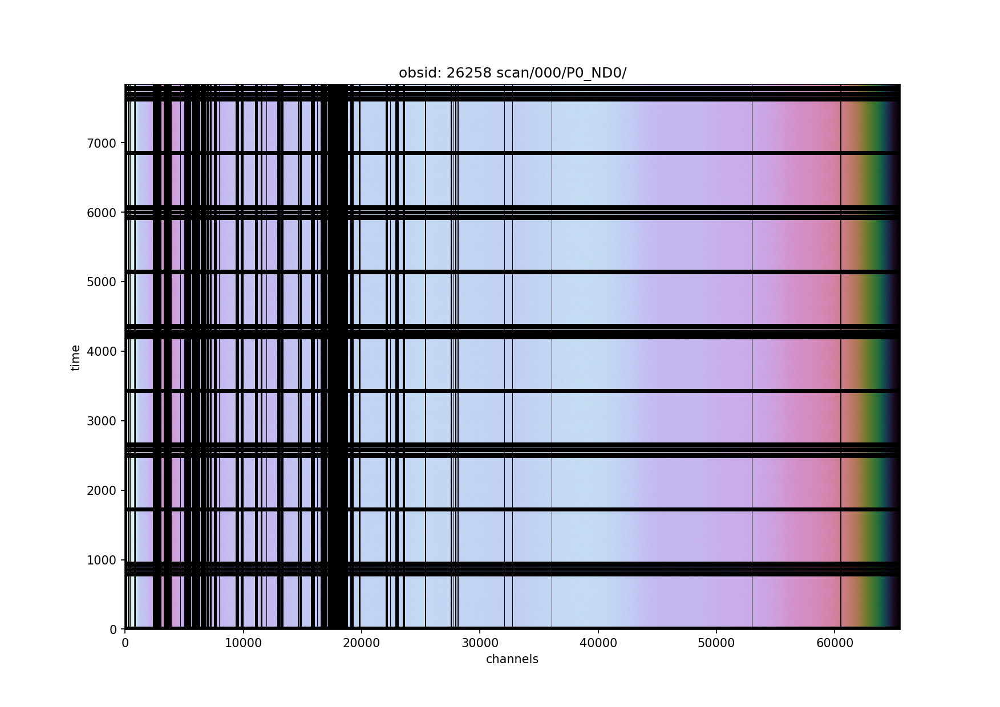
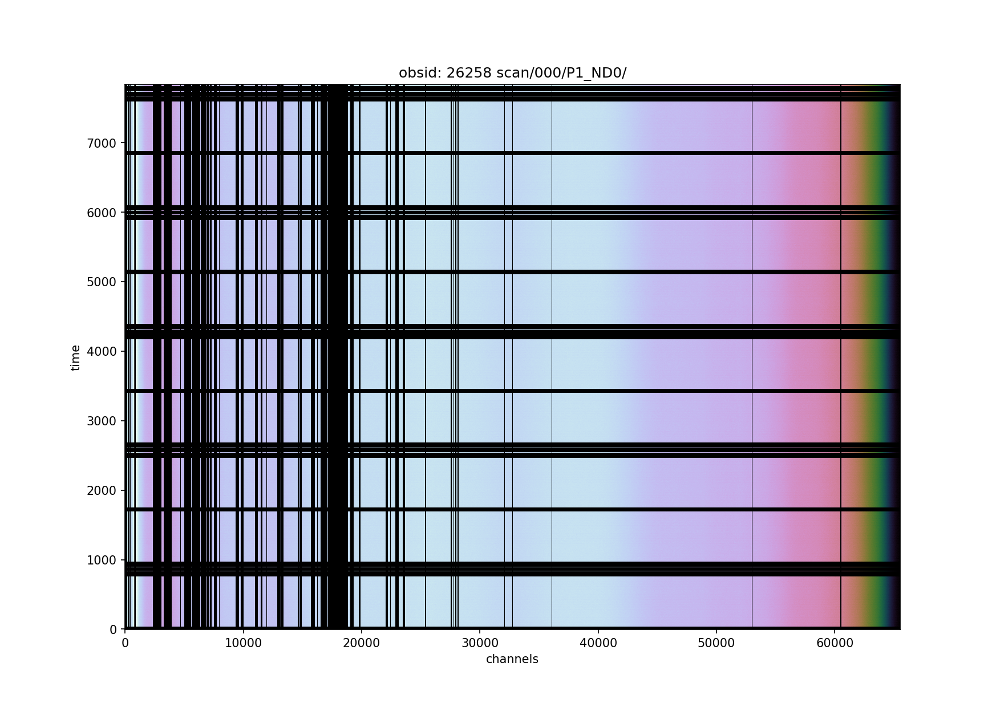

Averaged Spectrum (mean) and the standart derivation as error's in red per polarisation (P0/P1)

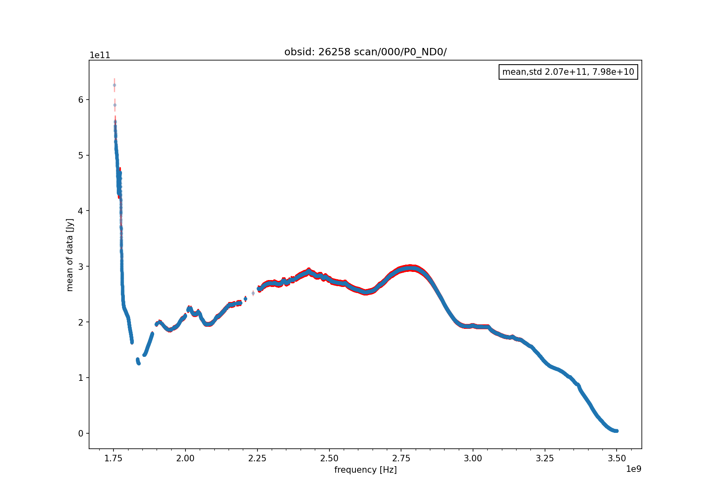
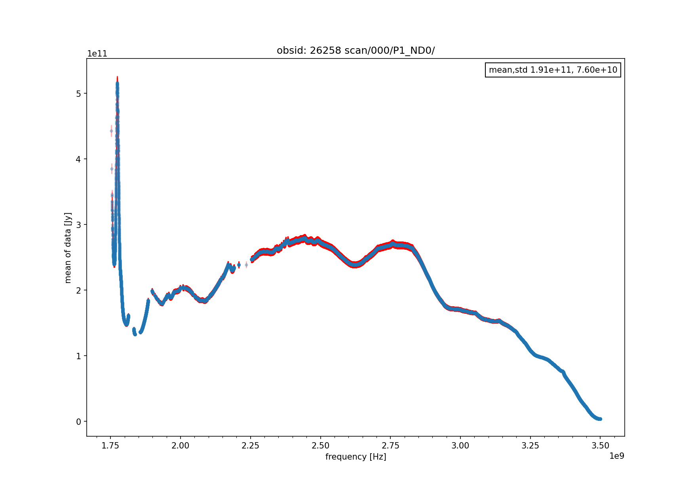


- Now do the **full heavy flagging**

```

python -W ignore SKAMPI_RFI_TOOL.py --DATA_FILE=EDD_2023-05-19T05_42_23.848010UTC_yWRaJ.hdf5 --DO_FG_TIME_AUTO_SIGMA=5 --DOPLOT_FINAL_WATERFALL --DOPLOT_FINAL_SPEC --DOSAVEPLOT --DOSAVEMASK=FULL_FLAG_MASK --DONOTCPUS

```

Note: that the setting --DONOTCPUS is sometimes faster than using
ncpus (if the number is small < 10). Runs 0.8 sec per spectrum ~ 1.5 hours for 1 polarisation

Waterfall Spectrum per polarisation (P0/P1)

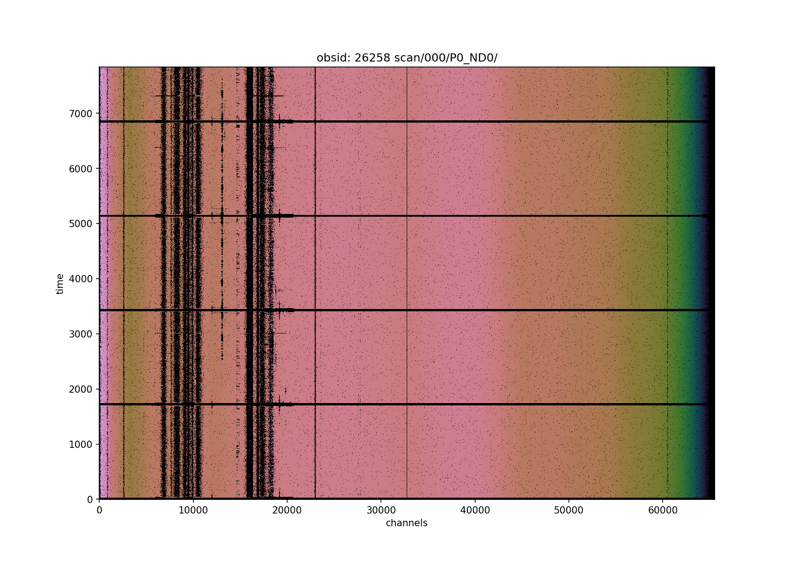
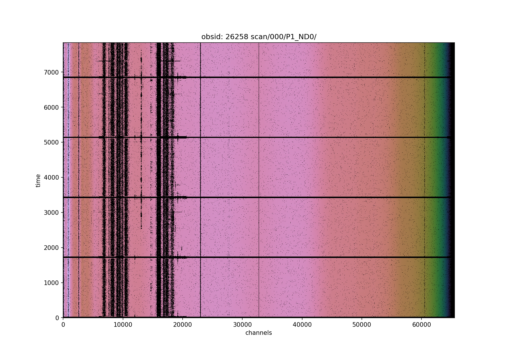

Averaged Spectrum (mean) and the standart derivation as error's in red per polarisation (P0/P1)

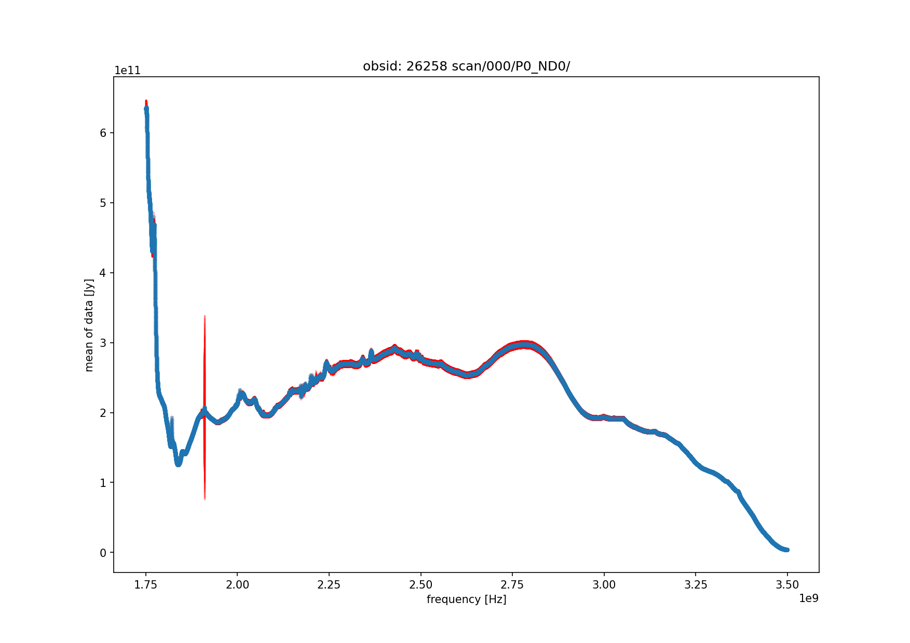
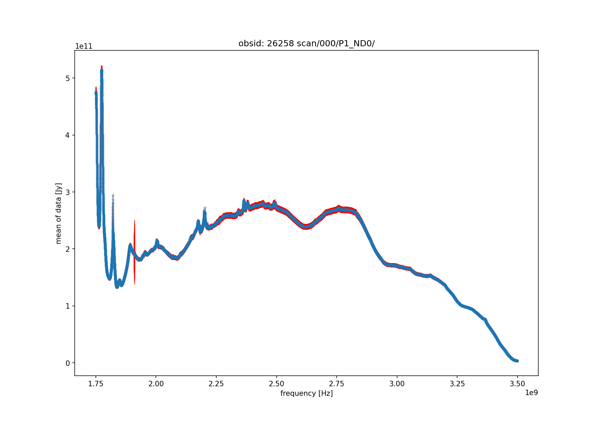

